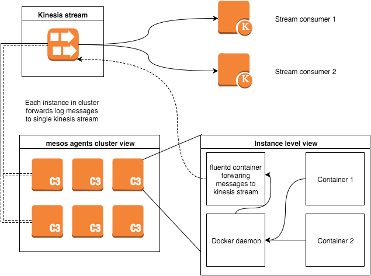

# Logstream

Logstream is grid feature that allows to collect logs from all containers scheduled via `grid-api` and push them to single AWS Kinesis stream. Currently is grid partitioned by AWS regions and this means there is one `kinesis` stream per `grid` instance. Its important to realize that logstreaming doesn't include logs from one-off containers that run on `mesos_agent` server type. Logging output of these containers must be handled per case basis.

## Design

Main building components of logstreaming are:

* [AWS Kinesis Stream](https://aws.amazon.com/kinesis/streams/) is destination for all logs produced by containers scheduled via `grid-api`. Each stream allows to ingest configured number of records per second and store them for 24 hours. This way consumers of the stream can work on their own pace and can handle small outages.
* [fluentd](http://www.fluentd.org/) is open source unified logging layer. It provides way to read log messages from different source, optionally transform messages and finally ship messages to final destination.
* [docker log drivers](https://docs.docker.com/engine/reference/logging/overview/) allow to specify where should be logs forwarded per container basis.

When `grid` is launched with `logstream` enabled it creates `kinesis` stream that will ingest all log messages from grid. Stream is available for internal use only and can't be exposed to end-users that are Acquia customers. Kinesis stream name is carried to `mesos-agent` CF stack.

Each launched `mesos-agent` server running containers will be running `fluentd` agent inside puppet managed container. `fluentd` agent container is launched per `mesos-agent`. `fluentd` daemon is launched with [aws-fluent-kinesis](https://github.com/awslabs/aws-fluent-plugin-kinesis) plugin. Puppet configures `fluentd` dameon to write all grid containers log to single kinesis stream. Since `fluentd` is launched in puppet managed container default `fluentd` port is exposed and mapped to host instance.

All scheduled containers will be configured to forward logs via `docker fluentd` driver to local exposed `fluentd` port via docker `log-driver` parameter. `grid-api` is responsible to provide correct `log-driver` and `log-opts` docker parameters that `mesos` framework will use when creating new container.




[Diagram source](images/grid-logstream.xml) created with [draw.io](https://www.draw.io/).

## Log message format

Log messages coming from docker containers are produced as `JSON` strings. Each log message produced by container is tagged with unique application id derived from manifest file. Current tag format is `grid.[manifest-id]:[app-id]` where `manifest-id` and `app-id` consist of `role/env/name`. Additionally each record has metadata about environment where message was produced, i.e. `container_id`, `tag`, `container_name`, `source` which can be either `stdout` or `stderr` and `log` representing produced message itself.

```json
{
  "container_name": "/mesos-20151118-102904-3271688202-5050-7886-S0.651d6d6d-1ebd-438e-b70e-f9955b98f6fb",
  "source": "stdout",
  "log": "MESSAGE",
  "container_id": "1d26ace2fa27c63bc77c6de4bdf611046a7b350a7b7c2e33eafac6b3cda5fe76",
  "time": "2015-12-04T13:39:27Z",
  "tag": "grid.devel/www-data/redis-test:devel/www-data/redis-test"
}
```

Kinesis stream gets `JSON` message serialized in `data` field with random generated uuid `partition_key`. Previous message produced by docker container looks in `kinesis` like

```json
{
  "data:"{\"container_name\":\"/mesos-20151118-102904-3271688202-5050-7886-S0.651d6d6d-1ebd-438e-b70e-f9955b98f6fb\",\"source\":\"stdout\",\"log\":\"MESSAGE\",\"container_id\":\"1d26ace2fa27c63bc77c6de4bdf611046a7b350a7b7c2e33eafac6b3cda5fe76\",\"time\":\"2015-12-04T13:39:27Z\",\"tag\":\"grid.devel/www-data/redis-test:devel/www-data/redis-test\"}",
  "partition_key:"667e482c-d048-4dd4-b636-1d8246eed98f"
}
```

## Launching grid with logstream

Grid has to be launched with various components in order to get logstream working. Components have to be launched in following order:

1.`acquia/fluentd` container image must be available in private registry. To build container follow general build instructions. Build script is available in this repository `build/containers/fluentd`.
* `kinesis stream` has to be launched with `nemesis` tool using `kinesis` template. Read AWS Kinesis documentation to determine required capacity. Example: `bundle exec nemesis launch logstream -t kinesis --shard_count 2`. Stack name is used in next step when launching `mesos-masters` and `mesos-agents` stacks.
* `mesos-masters` has to be launched with reference to `kinesis stream` running stack. `mesos-masters` stack accepts optional parameter `logstream` which represents name of running `kinesis` stack. Once `mesos-masters` stack is launched or updated with logstream name it can't removed without relaunching whole stack.
* `mesos-agents` similary to `mesos-masters` has to be launched with `logstream` parameter. Paramter has same behavior as in `mesos-masters` stack.
* `grid-api` must have logstream enabled when launching the api server. `grid-api` supports various parameters to configure logstream feature. It can be enabled with `--logstream` flag and configured further with `--logsteram-driver [driver-name]`, `--logstream-opts [opt1],[opt2]` and `--logstream-tag-prefix [prefix-name]`. See `grid-api` help for full documentation. Since `grid-api` is managed via puppet its automatically launched with `logstream` enabled when `logstream` parameter is provided to `mesos-masters`

Cloudwatch alarms can be turned on by specifying an email address to be alerted via the `--logsteam_alert_mail` flag. These alarms are triggered when either the write or read capacity reaches 90%.

## Creating logstream compatible container

To get log messages from running container its important to follow simple general rule of docker ecosystem and log everything to stdout and stderr. This can be harder to achieve in "fat" containers  since there are usually multiple processes running inside container. In such case its useful to leverage some existing solution like [`supervisor`](http://supervisord.org/) that acts as main process running in container and merge log messages from different places to single stream. Example: http://tech.paulcz.net/2014/12/multi-process-docker-images-done-right/

## Operation parameters, debugging

### Kinesis

Kinesis operation parameter is capacity of stream write (ingestion) and its read capacity. Stream capacity is expressed as number of shards in stream. Each shard provides capacity of 1000 put records, 1MB/s total write and 2MB of read capacity. Its possible to change capacity of running stack by changing `--shard_count` parameter. To change capacity run `update` command on running CF stack. 

Example: `nemesis update [stack_name] -t kinesis --shard_count 10`

More documentation how to [handle resharding](http://docs.aws.amazon.com/kinesis/latest/dev/kinesis-record-processor-scaling.html) on application level. Its desired that Consumers will use oficial [AWS Kinesis Client](http://docs.aws.amazon.com/kinesis/latest/dev/developing-consumers-with-kcl.html) Library which can handle resharding.

### Kinesis access

`fluent-kinesis-plugin` relies on having access via AWS `AssumeRole` and `ec2.amazonaws.com` to have `DescribeStream` and `Put*` permissions on `kinesis` stream. Container running `fluentd` with `fluent-kinesis-plugin` must have access to `ec2metadata` service.

### Fluentd buffering / kinesis outages

`fluentd` is configured to handle temporary outages of `kinesis`. `fluentd` provides option to buffer log messages in case of outage. `fluentd` is configured to store failed messages in file buffers. Total buffer capacity of 2GB is configured as 128 x 16MB buffers files. Buffered messages are stored on volume shared from host instance so they will be available after `fluentd` container restart. In case of filling that buffer `fluentd` will stop accepting new messages. `fluentd` retries 17 times before dropping log message.

### Fluentd configuration updates

`fluentd` daemon supports updating configuration without need to do full restart. Configuration updates of running `fluentd` containers are automatically managed via `puppet`. All configuration updates should be done only via puppet `fluentd.conf.rb` template file.

## One off containers logging

As mentioned earlier `logstream` is available only for container scheduled via internal `grid-api`. Any other container launched on grid, for example container running `grid-api` has to configure proper log driver. Its recommended to forward logs to local instance `syslog`. This is still work in progress and ideally there will be similar way handle internal logs. Advantage of sending messages to `syslog` is that `syslog` dameon launched on grid is configured to get its logs rotated, to prevent saturating local instance disk space with old log messages.
